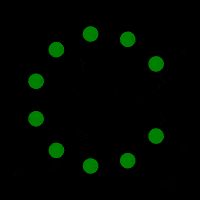

# Imaginary Rotoscopes

Rotoscoping the motion of roots across the complex plane.

## Examples

#### Ordered set
 
    periods = [0,1,2,3,4,5,6,7,8,9,10,11,12,13,14]

	

#### Unity (boring)

    periods = [0,1,1,1,1,1,1,1,1,1]

#### Unity (with phase shifts)

    periods = [0,1,1,1,1,1,1,1,1,1]
    phase = np.linspace(0,twopi*2,periods.size)

#### Alternating twos

    periods = [0,2,3,4,2,5,2,6]

 
#### Signs

    periods = [0,1,-1,2,-2,3,-3,4,-4,5,-5]

#### wigglewigglewiggle

    periods = np.random.uniform(size=50)*(50/10.0) * 2 -1
    phase = np.linspace(0,twopi*2,periods.size)

#### static trace over sqrt(primes)
  
    n=6
    q=[0,2,3,5,7,11,13]
    f=cos(sqrt(q)*t)
    t=linspace(0,10, 10000)

### Presentation

http://thoppe.github.io/imaginary_rotoscopes/HnT_pres.html#/

First presented at [DC: Hack && Tell Round 31: Temporal aperture](https://www.meetup.com/DC-Hack-and-Tell/events/227724676/).
